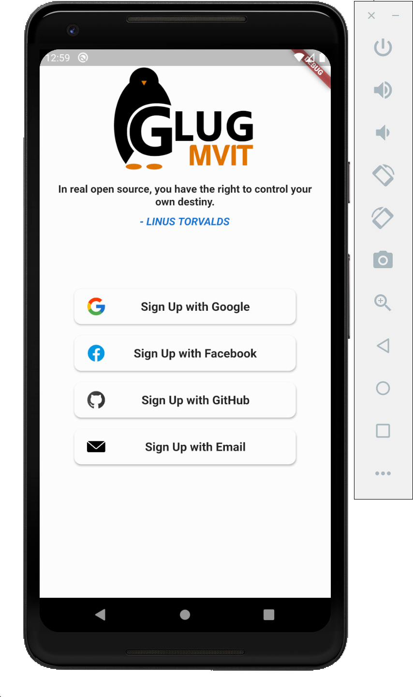

# Glug-App
An App for GLUG MVIT !! 

Stay connected anywhere, anytime with GLUG MVIT.

## The app so far

<table>
  <tr>
    <td></td>
    <td></td>
    <td></td>
  </tr>
</table>

**FEATURES**
* Compose a post that you can save to draft or immediately publish.
* View existing posts.
* View list of published posts.
* Switch account/blog if you have more than one.

With the GLUG MVIT app for Android, you can quickly and easily access posts to our blog wherever you are.

:construction: Under Construction by a team of Flutter Devs !! :construction:

